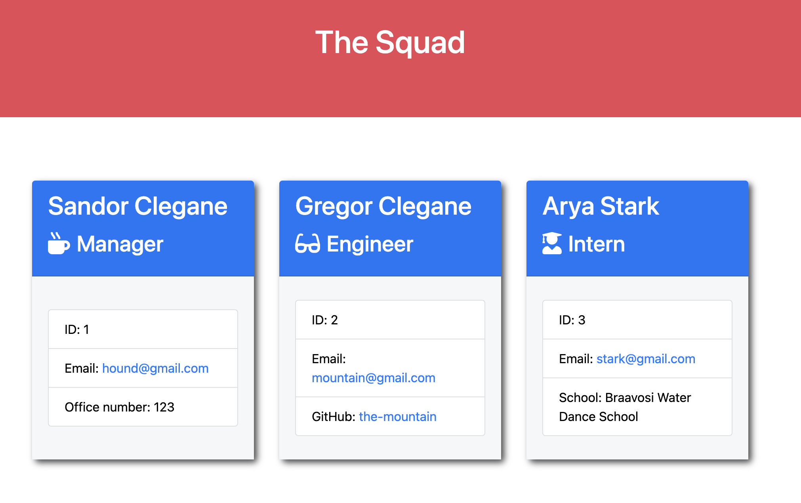

# NonStop Squad Generator

## Description
AS A manager I WANT to generate a webpage that displays my team's basic info SO THAT I have quick access to their emails and GitHub profiles.

## Table of Contents
  - [Usage](#usage)
  - [Tests](#tests)
  - [Installation](#installation)
  - [Contributing](#contributing)
  - [Questions](#questions)

## Usage
GIVEN a command-line application that accepts user input
WHEN I am prompted for my team members and their information
THEN an HTML file is generated that displays a nicely formatted team roster based on user input
WHEN I click on an email address in the HTML
THEN my default email program opens and populates the TO field of the email with the address
WHEN I click on the GitHub username
THEN that GitHub profile opens in a new tab
WHEN I start the application
THEN I am prompted to enter the team manager’s name, employee ID, email address, and office number
WHEN I enter the team manager’s name, employee ID, email address, and office number
THEN I am presented with a menu with the option to add an engineer or an intern or to finish building my team
WHEN I select the engineer option
THEN I am prompted to enter the engineer’s name, ID, email, and GitHub username, and I am taken back to the menu
WHEN I select the intern option
THEN I am prompted to enter the intern’s name, ID, email, and school, and I am taken back to the menu
WHEN I decide to finish building my team
THEN I exit the application, and the HTML is generated

Getting Started
This Challenge will combine many of the skills you’ve learned over the first ten weeks of this course. To help you get started, we’ve provided some guidelines in addition to the User Story and Acceptance Criteria.

Your application should use Jest (Links to an external site.) for running the unit tests and Inquirer (Links to an external site.) version 8.2.4 for collecting input from the user. The application will be invoked by using the following command:

node index.js

## Directory setup and Tests

Directory structure that looks like this:

.
├── __tests__/             //jest tests
│   ├── Employee.test.js
│   ├── Engineer.test.js
│   ├── Intern.test.js
│   └── Manager.test.js
├── dist/                  // rendered output (HTML) and CSS style sheet      
├── lib/                   // classes
├── src/                   // template helper code 
├── .gitignore             // indicates which folders and files Git should ignore
├── index.js               // runs the application
└── package.json           

The application has classes: Employee, Manager, Engineer, and Intern. The tests for these classes (in the _tests_ directory) 

The first class is an Employee parent class with the following properties and methods:

name
id
email

getName()
getId()
getEmail()
getRole() // Returns 'Employee'

The other three classes extend Employee.

In addition to Employee's properties and methods, Manager will also have:
officeNumber
getRole() // Overridden to return 'Manager'
I have also added getOfficeNumber()

In addition to Employee's properties and methods, Engineer will also have:
github // GitHub username
getGithub()
getRole() // Overridden to return 'Engineer'

In addition to Employee's properties and methods, Intern will also have:
school
getSchool()
getRole() // Overridden to return 'Intern'

## Video Walkthrough

Video walkthrough can be found here:

https://drive.google.com/file/d/1j-YqgBvROqMf9tmHOI8aMSw_sZTiiDAG/view

## Screenshot

## Installation
Clone the GitHub; node.js install; npm install; npm init; run [node index.js] to begin 

## Questions

Have questions?
You can find me on GitHub:
https://github.com/BeKind-Rewind

Or email me at:
Challenge641@gmail.com

    